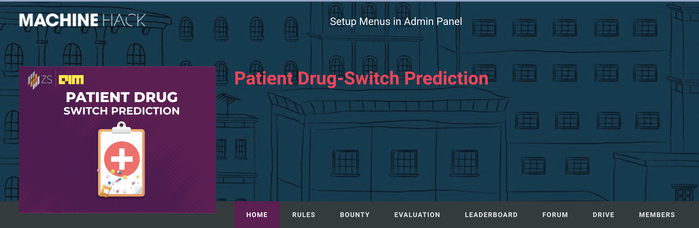

# MachineHack-Patient-Drug-Switch-Prediction
https://www.machinehack.com/course/zs-hiring-hackathon-patient-drug-switch-prediction/

</a>

1. Run "python Feature_Pipeline.py"
### The auto feature engineering takes almost ~17 minutes to complete on a machine with RAM of 16 GB with 4 cores to recreate all features and fitness values

2. Run "python Model.py"
### The Model training takes ~45minutes to complete.
